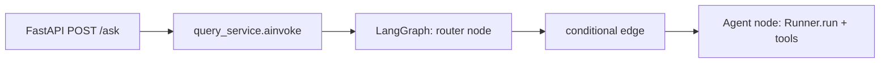

# Learning guide — Enterprise Intelligence

This repo is structured so you can **read the code** and map it to **real concepts** in each library. Use this guide as a syllabus: follow the table, trace one request through the stack, then try the suggested experiments.

---

## 1. What this project demonstrates

| Technology | Core concepts you should notice | Primary code locations |
|------------|----------------------------------|-------------------------|
| **FastAPI** | ASGI app, `lifespan` startup/shutdown, `APIRouter`, automatic OpenAPI (`/docs`), dependency-free route handlers | [`app/main.py`](app/main.py), [`app/api/routes.py`](app/api/routes.py), [`app/core/lifecycle.py`](app/core/lifecycle.py) |
| **Pydantic v2** | `BaseModel`, `Field`, `field_validator`, `ConfigDict`, request/response schemas as API contracts | [`app/api/schemas.py`](app/api/schemas.py) |
| **LangGraph** | `StateGraph`, **shared state** (`TypedDict`), **nodes** (async functions), **conditional edges** (router → one branch), **reducers** (`add_messages` for future multi-turn), `compile()`, `ainvoke()` | [`app/workflows/graph.py`](app/workflows/graph.py), [`app/workflows/state.py`](app/workflows/state.py), [`app/services/query_service.py`](app/services/query_service.py) |
| **OpenAI Agents SDK** (`openai-agents`) | `Agent` (instructions + model + tools), `Runner.run()` (async), **`@function_tool`** (LLM-callable tools), separating **tool handles** from **plain `*_impl` functions** for fallbacks | [`app/agents/*_agent.py`](app/agents/), [`app/agents/tools.py`](app/agents/tools.py), [`app/agents/runner_utils.py`](app/agents/runner_utils.py), [`app/agents/router.py`](app/agents/router.py) |
| **RAG (vector-less)** | **Ingestion** (PDF → text → chunks), **retrieval** via DB full-text search (no embeddings), optional **RPC** wrapper in Postgres | [`app/rag/uploader.py`](app/rag/uploader.py), [`app/rag/retriever.py`](app/rag/retriever.py) |
| **MCP (Model Context Protocol)** | **Primitives**: Tools (`tools/call`), Resources (`resources/read`), Prompts (`prompts/get`), stdio transport. **Agents SDK**: `Agent.mcp_servers` + `MCPServerManager` for `connect`/`cleanup`; wrappers only where the SDK does not expose resources/prompts as tools | [`app/mcp_server/server.py`](app/mcp_server/server.py), [`app/agents/enterprise_mcp_stdio.py`](app/agents/enterprise_mcp_stdio.py), [`app/agents/pdf_agent.py`](app/agents/pdf_agent.py), [`app/mcp_server/stdio_session.py`](app/mcp_server/stdio_session.py), [`app/mcp_server/client_runtime.py`](app/mcp_server/client_runtime.py), [`app/agents/tools.py`](app/agents/tools.py) (resources/prompts + fallback PDF) |
| **Supabase / PostgREST** | Client factory, `insert` (batch), `rpc` for search | [`app/core/database.py`](app/core/database.py), [`app/rag/`](app/rag/) |

---

## 2. Mental model: two layers of “agents”

1. **LangGraph** = **orchestrator**. It owns **state** and **control flow** (which *node* runs next). It does not replace the LLM; it wires *when* each specialist runs.
2. **OpenAI Agents SDK** = **specialist inside a node**. Each node runs an `Agent` with tools; `Runner.run()` handles the **tool loop** (model decides → call tool → model continues) until a final answer.

So: **graph = routing and state**, **Agent SDK = reasoning + tools inside one step**.

**MCP inside the Agent (recommended):** The OpenAI Agents SDK exposes MCP **tools** when you pass `mcp_servers=[...]` after `MCPServerManager` has called `connect()`. That is preferable to hand-rolling `tools/call` for every MCP endpoint. This repo uses native MCP for `generate_pdf` / `get_server_status`, and keeps small wrappers only for **resources** and **prompts** (not auto-exported as tools by the SDK).

---

## 3. Trace one request (read the code in this order)

1. **HTTP** — [`app/api/routes.py`](app/api/routes.py): `AskRequest` validation (Pydantic).
2. **Orchestration** — [`app/services/query_service.py`](app/services/query_service.py): build initial `GraphState`, `await graph.ainvoke(...)`.
3. **Router** — [`app/agents/router.py`](app/agents/router.py): fast rules + optional LLM fallback; sets `state["route"]`.
4. **Graph** — [`app/workflows/graph.py`](app/workflows/graph.py): `add_conditional_edges("router", ...)` picks `rag` / `web` / `stock` / `pdf`.
5. **Specialist** — e.g. [`app/agents/rag_agent.py`](app/agents/rag_agent.py): `Runner.run(_rag_agent, question)`; tools in [`app/agents/tools.py`](app/agents/tools.py) call [`app/rag/retriever.py`](app/rag/retriever.py).
6. **Response** — service returns `{question, route, answer}` for [`AskResponse`](app/api/schemas.py).

---

## 4. Concepts worth comparing (interview / design level)

- **LangChain `AgentExecutor` vs LangGraph**: LangGraph makes **explicit graphs** and **persistent state**; easier to debug routes and add human-in-the-loop later.
- **Vector RAG vs this project**: Here, **PostgreSQL `tsvector` / full-text search** trades semantic fuzziness for simpler ops and no embedding pipeline; good for learning retrieval mechanics first.
- **MCP vs “function calling only”**: MCP standardizes **tool discovery and transports** (often stdio or HTTP); the PDF path shows **out-of-process** tool execution.
- **Pydantic at the boundary**: Validates **untrusted input** at the API; internal graph state stays typed with **`TypedDict`** for LangGraph compatibility.

---

## 5. Hands-on experiments (keep the app runnable)

1. **LangGraph**: Log `state` at the end of `router_node` and after each agent node (temporary `print` or logger) to see merges.
2. **Agent SDK**: Temporarily remove a tool from `_rag_agent` and observe how answers change; restore afterward.
3. **RAG**: Upload a small PDF, then query phrasing that matches / does not match chunks — see FTS behavior.
4. **MCP**: Run the MCP module alone (`python -m app.mcp_server.server`) and compare that to ``Agent.mcp_servers`` + ``MCPServerManager`` in ``pdf_agent`` (native tools) versus ``generate_pdf_report_impl`` (manual stdio client used only in fallbacks).
5. **Pydantic**: Send too-long `question` or whitespace-only body to `/ask` and read validation errors in the response.

---

## 6. Documentation map

| Doc | Use when |
|-----|----------|
| [README.md](README.md) | Setup, env vars, endpoints |
| [ARCHITECTURE.md](ARCHITECTURE.md) | Layered design, security notes |
| [PROJECT_STRUCTURE.md](PROJECT_STRUCTURE.md) | Directory responsibilities, imports |
| [DEVELOPER_GUIDE.md](DEVELOPER_GUIDE.md) | Day-to-day tasks |
| [DOCUMENTATION_INDEX.md](DOCUMENTATION_INDEX.md) | Full index of all `.md` files |

**This file** (`LEARNING_GUIDE.md`) is the **concept syllabus** tied to concrete modules.

---

## 7. Best practices already reflected in code

- **Single config source** — [`app/core/config.py`](app/core/config.py); optional shim [`app/config.py`](app/config.py).
- **Explicit initial graph state** for reducers — [`app/services/query_service.py`](app/services/query_service.py).
- **Tool implementation split** — `*_impl` for direct calls, `@function_tool` for the LLM — [`app/agents/tools.py`](app/agents/tools.py).
- **Stable API output** — service returns a fixed dict shape for OpenAPI consumers.
- **Batch ingestion** for RAG — [`app/rag/uploader.py`](app/rag/uploader.py).

Use these as patterns when you extend the project (e.g. a new LangGraph node or a new `function_tool`).
